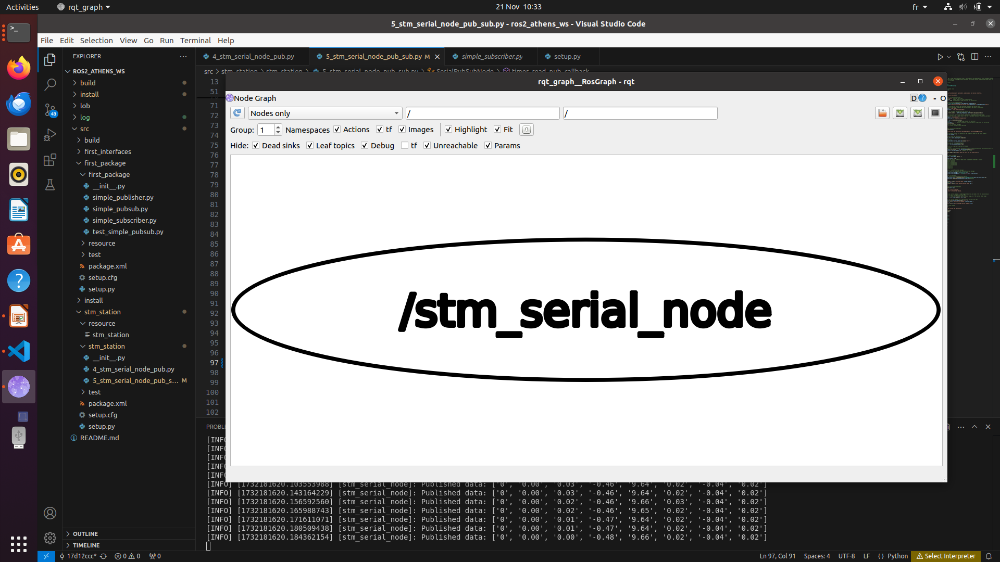
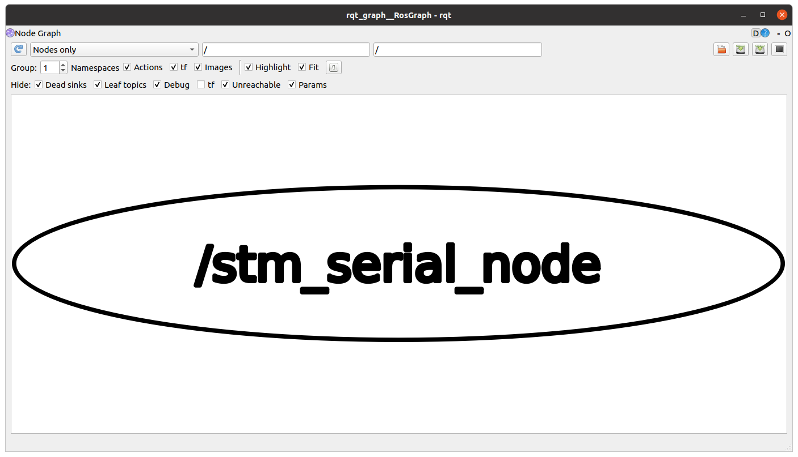

# delivrable 1.1 :
```
athens@ROSCourseAthens:~$ ros2 topic list
/parameter_events
/rosout
/stm_control/publisher

athens@ROSCourseAthens:~$ ros2 topic echo /stm_control/publisher
layout:
  dim: []
  data_offset: 0
data:
- 0.0
- 0.0
- 0.009999999776482582
- -0.47999998927116394
- 9.619999885559082
- 0.019999999552965164
- -0.03999999910593033
- 0.019999999552965164
---
layout:
  dim: []
  data_offset: 0
data:
- 0.0
- 0.0
- 0.019999999552965164
- -0.47999998927116394
- 9.619999885559082
- 0.019999999552965164
- -0.03999999910593033
- 0.019999999552965164
---
layout:
  dim: []
  data_offset: 0
data:
- 0.0
- 0.0
- 0.029999999329447746
- -0.49000000953674316
- 9.619999885559082
- 0.019999999552965164
- -0.03999999910593033
- 0.019999999552965164
---
layout:
  dim: []
  data_offset: 0
data:
- 0.0
- 0.0
- 0.03999999910593033
- -0.5
- 9.630000114440918
- 0.019999999552965164
- -0.03999999910593033
- 0.019999999552965164
---
```




# delivrable 1.2
```
athens@ROSCourseAthens:~/ros2_athens_ws$ ros2 topic list
/parameter_events
/rosout
/stm_control
/stm_state


athens@ROSCourseAthens:~/ros2_athens_ws$ ros2 topic echo /stm_state

layout:
  dim: []
  data_offset: 0
data:
- -984.0
- 0.0
- 0.0
- -0.4699999988079071
- 9.630000114440918
- 0.029999999329447746
- -0.03999999910593033
- 0.019999999552965164
---
layout:
  dim: []
  data_offset: 0
data:
- -984.0
- 0.0
- -0.029999999329447746
- -0.47999998927116394
- 9.630000114440918
- 0.019999999552965164
- -0.03999999910593033
- 0.019999999552965164
---

^Cathens@ROSCourseAthens:~/ros2_athens_ws$ ros2 topic echo /stm_control

```




# delivrable 3

Result:tf2_msgs.srv.FrameGraph_Response(
  frame_yaml="turtle2: \n  parent: 'world'\n  broadcaster: 'default_authority'\n  rate: 55.011\n  most_recent_transform: 1732278129.185712\n  oldest_transform: 1732278124.168563\n  buffer_length: 5.017\nturtle1: \n  parent: 'world'\n  broadcaster: 'default_authority'\n  rate: 55.513\n  most_recent_transform: 1732278129.180966\n  oldest_transform: 1732278124.173113\n  buffer_length: 5.008\n")
